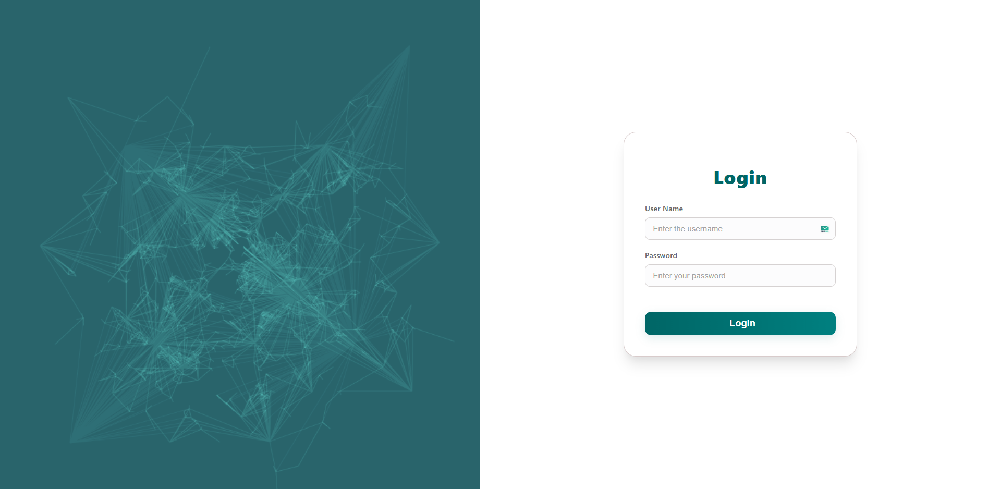

<h1 align="center">📊 EasyMadeInsights — Data Insights Made Simple</h1>

  
" alt="EasyMadeInsights Logo" width="280">

  A smart analytics platform that converts your raw Excel data into meaningful insights using a clean dashboard, automated KPIs, charts, and soon — AI-powered explanations.

  <strong>Version:</strong> Beta v0.1  

---

  
  
  
  

---

# 🌟 What is EasyMadeInsights?

**EasyMadeInsights** is a web-based tool where users can upload Excel files and instantly view:
- 📌 Automatically generated KPIs  
- 📈 Dynamic charts  
- 🧠 AI-generated insights (coming soon)  
- 📊 Clean dashboards to understand your business data  

The goal is simple:  
**Make analytics easy for everyone — without needing Power BI, Excel formulas, or coding.**

---

# 🚀 Features (Current MVP)

### ✔ Upload Excel Files  
Supports `.xlsx` and `.xls`, including multiple sheets.

### ✔ Auto-Generated KPIs  
Instant metrics such as:
- Total rows  
- Number of numeric columns  
- Sheets detected  

### ✔ Dashboard UI  
A modern layout including:
- Left sidebar  
- Top navbar  
- KPI cards  
- Chart containers  

### ✔ Chart Components (Frontend Ready)  
Currently placeholders for:
- Bar Chart  
- Line Chart  
(Backend integration coming soon)

---

# 🛠️ Tech Stack

| Layer | Technology |
|-------|------------|
| **Frontend** | React (Vite) + JavaScript |
| **Styling** | Custom CSS (no frameworks) |
| **Charts** | Recharts (coming soon) |
| **Backend** | Node.js + Express (upcoming) |
| **Analytics Engine** | Python (pandas, numpy) |
| **AI Insights** | OpenAI / LLM integration (future) |

---
