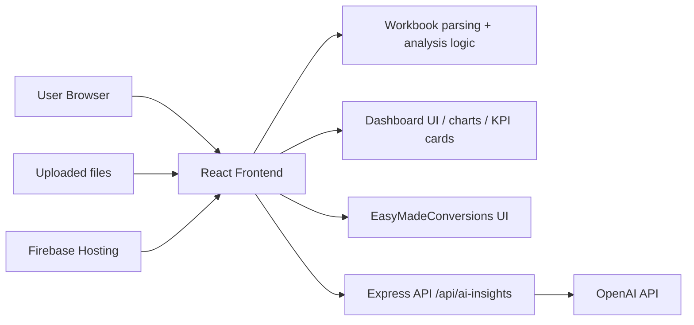
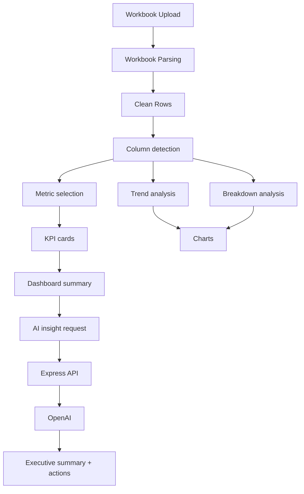
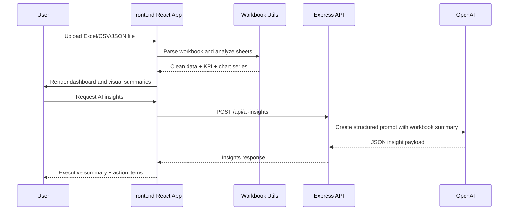

# EasyMadeInsights

EasyMadeInsights is a data-analysis and business-intelligence web app designed to help users upload spreadsheet files, clean and analyze tabular data, visualize trends, and generate AI-driven business insights. The platform also includes a secondary toolset called EasyMadeConversions for document/file utilities such as PDF conversion, image conversion, JWT decoding, and file comparison.

This project is built as a React SPA with a lightweight Express API for AI-backed insight generation, and it is intended for deployment on Firebase Hosting.

## 1. Product overview

EasyMadeInsights turns raw spreadsheet data into an executive-ready decision-support experience.

The product has two major parts:

- Core analytics dashboard for spreadsheet ingestion and business analysis
- EasyMadeConversions module for file/document utilities

### Primary user goals

- Upload Excel or tabular files from local storage
- Clean and normalize messy data automatically
- Detect metric columns, category columns, and date columns
- Visualize trends and distributions using charts
- View KPI summaries and workbook-level metrics
- Ask for AI-generated business recommendations via backend API
- Access conversion and developer utilities in a second page/module

### Example business use cases

- Reviewing sales reports across regions or product lines
- Investigating product performance by category or month
- Summarizing operational metrics from CSV exports
- Creating quick, visually understandable reporting snapshots for stakeholders
- Converting files or inspecting developer payloads without leaving the app

---

## 2. High-level architecture


```mermaid
flowchart LR
    A[User Browser] --> B[React Frontend]
    B --> C[Workbook parsing + analysis logic]
    B --> D[Dashboard UI / charts / KPI cards]
    B --> E[EasyMadeConversions UI]
    B --> F[Express API /api/ai-insights]
    F --> G[OpenAI API]
    H[Uploaded files] --> B
    I[Firebase Hosting] --> B
```

### Runtime split

- Frontend: Vite + React SPA
- Backend: Express server (`server.mjs`)
- Data processing: client-side workbook parsing using `xlsx`
- AI: OpenAI responses API
- Static hosting: Firebase Hosting

---

## 3. Core capabilities

### 3.1 Spreadsheet upload and parsing

The app accepts:

- `.xlsx`
- `.xls`
- `.csv`
- `.tsv`
- `.json`

The upload flow is driven by `FileUpload.jsx` and workbook logic is centered in `src/utils/workbook.js`.

### 3.2 Data cleaning and normalization

The workbook analyzer performs automatic data preparation such as:

- removing empty rows
- normalizing column values
- handling missing values
- deduplicating repeated rows
- classifying fields as numeric, category, or date-like

This is implemented by helper functions like:

- `cleanRows()`
- `parseNumericValue()`
- `parseDateValue()`
- `analyzeSheet()`
- `buildWorkbookSummary()`

### 3.3 KPI and summary generation

The app builds workbook-level summary metrics such as:

- total numeric totals
- average values
- top categories
- distribution trends
- primary metric detection
- date/category breakdown suggestions

These values power the KPI cards in `Dashboard.jsx` and the metric summaries shown in the dashboard.

### 3.4 Charts and visual analytics

The dashboard uses Recharts to present:

- bar charts
- line charts
- area charts
- pie charts
- trend visualizations for selected numeric dimensions

The chart configuration is defined in `Dashboard.jsx`, while the analysis logic is structured in `workbook.js`.

### 3.5 AI insights layer

The backend API route `POST /api/ai-insights` receives workbook context and a ready-made summary payload, then sends a structured prompt to OpenAI.

The response is expected in a strict JSON schema containing:

- `executive_summary`
- `key_insights`
- `risks_and_opportunities`
- `recommended_actions`

This gives the dashboard a business-focused AI narrative block without exposing raw spreadsheet logic to the client.

### 3.6 EasyMadeConversions module

This module is an internal utility library within the app and includes tools such as:

- PDF to Word conversion
- Word to PDF conversion
- image conversion and optimization
- file comparison diff views
- JWT decoding and inspection

The tool UI is surfaced via the `ToolModal` plus tool-specific components in `src/components/tools/`.

---

## 4. Feature architecture


```mermaid
flowchart TD
    A[Workbook Upload] --> B[Workbook Parsing]
    B --> C[Clean Rows]
    C --> D[Column detection]
    D --> E[Metric selection]
    D --> F[Trend analysis]
    D --> G[Breakdown analysis]
    E --> H[KPI cards]
    F --> I[Charts]
    G --> I
    H --> J[Dashboard summary]
    J --> K[AI insight request]
    K --> L[Express API]
    L --> M[OpenAI]
    M --> N[Executive summary + actions]
```

---

## 5. Application structure

```text
client/
├── public/
│   ├── easy-made-insights-logo.png
│   ├── EasyMadeConversion_logo.png
│   ├── robots.txt
│   └── sitemap.xml
├── src/
│   ├── App.jsx
│   ├── main.jsx
│   ├── components/
│   │   ├── AIInsightsPanel.jsx
│   │   ├── ChartCard.jsx
│   │   ├── FileUpload.jsx
│   │   ├── KPI.jsx
│   │   ├── Loader.jsx
│   │   ├── Navbar.jsx
│   │   ├── SheetSelector.jsx
│   │   ├── Sidebar.jsx
│   │   ├── ToolModal.jsx
│   │   ├── WelcomeOverlay.jsx
│   │   └── tools/
│   │       ├── DocxPreview.jsx
│   │       ├── FileComparison.jsx
│   │       ├── ImageConverter.jsx
│   │       ├── JWTDecoder.jsx
│   │       ├── PDFToWord.jsx
│   │       └── WordToPDF.jsx
│   ├── pages/
│   │   ├── Dashboard.jsx
│   │   ├── EasyMadeConversions.jsx
│   │   └── NotFound.jsx
│   ├── styles/
│   │   ├── ai-insights.css
│   │   ├── charts.css
│   │   ├── conversions.css
│   │   ├── dashboard.css
│   │   ├── kpi.css
│   │   ├── loader.css
│   │   ├── navbar.css
│   │   ├── sheetselector.css
│   │   ├── sidebar.css
│   │   ├── tools.css
│   │   ├── upload.css
│   │   └── welcome.css
│   └── utils/
│       └── workbook.js
├── index.html
├── server.mjs
├── vite.config.js
├── package.json
├── .gitignore
├── eslint.config.js
├── firebase.json
├── .firebaserc
├── README.md
└── package-lock.json
```

---

## 6. Frontend components and responsibilities

### `App.jsx`

Responsible for:

- theme setup
- route registration
- page-level SEO metadata updates
- app shell layout
- navigation and welcome overlay state

### `Dashboard.jsx`

This is the main analytics experience. It handles:

- file upload state
- workbook selection and active sheet state
- chart generation
- KPI calculations
- AI insight requests
- workbook summary rendering
- sections for overview, charts, insights, and preview

### `FileUpload.jsx`

Provides upload interaction and triggers the workbook import flow.

### `SheetSelector.jsx`

Lets the user switch between workbook sheets after loading a file.

### `AIInsightsPanel.jsx`

Displays AI-generated executive insights and recommended actions.

### `ToolModal.jsx`

Embeds conversions and utility tools in a modal container, using a tool ID switch to render different utility components.

### `components/tools/*`

Each tool component is focused on one utility:

- `ImageConverter.jsx` handles crop, resize, quality, format changes
- `FileComparison.jsx` compares two text files with diff output
- `PDFToWord.jsx` converts PDF to DOCX with preview
- `WordToPDF.jsx` converts Word docs to PDF with preview
- `JWTDecoder.jsx` decodes JWT payload and metadata

---

## 7. Workbook analysis logic

The spreadsheet analysis runtime is deeply rooted in `src/utils/workbook.js`.

### Key responsibilities

- infer data shape from rows and columns
- identify numeric/date/category columns
- preserve only valid rows
- fill missing values when required
- aggregate metrics for charting
- generate workbook summaries
- convert raw data into chart-friendly structures

### Important analysis helpers

- `cleanRows(rows)` — sanitizes uploaded data
- `aggregateByColumn()` — groups rows by category and metric
- `buildBarData()`, `buildLineData()` — chart data creation
- `buildMetricSummary()` — metric-level summaries
- `formatMetricDisplay()` — metric number formatting
- `parseNumericValue()`, `parseDateValue()` — type parsing utilities

### Data quality behavior

The workbook logic is intentionally opinionated and designed to help with quick business analysis:

- numeric columns are normalized into numbers
- empty values are imputed using column-specific defaults
- categorical columns are normalized into strings
- duplicate rows are removed
- chart series are capped for readability

The constants used for chart generation are:

- `MAX_BAR_POINTS = 8`
- `MAX_LINE_POINTS = 12`
- `MAX_PIE_POINTS = 5`

---

## 8. Backend API and AI integration

The backend server is in `server.mjs` and is run via the dev script from `package.json`:

```bash
npm run dev
```

This starts both:

- Vite frontend server on port `5173`
- Express API server on port `8787`

### API endpoints

#### `GET /api/health`

Returns:

- `ok`
- `aiConfigured`
- `model`

#### `POST /api/ai-insights`

Authorization-free request from the frontend, passes workbook metadata and a summary. It validates environment variables and calls OpenAI.

### AI prompt structure

A system prompt instructs the model to behave like a professional business analyst and return concise, executive-ready output based strictly on the workbook summary. The route requires a strict JSON schema, which prevents malformed or hallucinated output shapes.

### Environment requirements

The app expects the following environment variable:

```text
OPENAI_API_KEY
```

Optional:

```text
OPENAI_MODEL
PORT
```

---

## 9. Tech stack and dependencies

### Frontend

| Package | Version | Purpose |
|---|---:|---|
| `react` | `^19.2.0` | UI library |
| `react-dom` | `^19.2.0` | DOM rendering |
| `react-router-dom` | used in app | client-side routing |
| `vite` | `^7.2.4` | build tool and dev server |
| `@vitejs/plugin-react` | `^5.1.1` | React integration for Vite |
| `recharts` | `^3.8.1` | charts and dashboards |
| `xlsx` | `^0.18.5` | Excel / CSV / TSV parsing |

### Backend

| Package | Version | Purpose |
|---|---:|---|
| `express` | `^5.2.1` | API server |
| `cors` | `^2.8.6` | cross-origin request handling |
| `dotenv` | `^17.4.2` | environment variable loading |
| `openai` | `^6.34.0` | OpenAI SDK |

### Conversion/document utilities

| Package | Version | Purpose |
|---|---:|---|
| `mammoth` | `^1.12.0` | DOCX to HTML/text extraction |
| `pdfjs-dist` | `^5.7.284` | PDF preview and text extraction |
| `docx-preview` | `^0.3.7` | DOCX rich preview rendering |

### Tooling and dev dependencies

| Package | Purpose |
|---|---|
| `concurrently` | run frontend and backend together |
| `eslint` | linting |
| `@eslint/js` | base JS linting rules |
| `eslint-plugin-react-hooks` | React Hooks linting |
| `eslint-plugin-react-refresh` | Vite React fast-refresh checks |

### Deployment platform

- Firebase Hosting
- CI/CD is optionally configured via Firebase tooling, with static app deployment from `dist/`

---

## 10. Scripts and commands

### Install dependencies

```bash
npm install
```

### Run app locally

```bash
npm run dev
```

This starts both the frontend and API in parallel.

### Build for production

```bash
npm run build
```

### Preview built app

```bash
npm run preview
```

### Lint

```bash
npm run lint
```

---

## 11. Data flow in the app


```mermaid
sequenceDiagram
    participant U as User
    participant F as Frontend React App
    participant W as Workbook Utils
    participant A as Express API
    participant O as OpenAI

    U->>F: Upload Excel/CSV/JSON file
    F->>W: Parse workbook and analyze sheets
    W-->>F: Clean data + KPI + chart series
    F->>U: Render dashboard and visual summaries
    U->>F: Request AI insights
    F->>A: POST /api/ai-insights
    A->>O: Create structured prompt with workbook summary
    O-->>A: JSON insight payload
    A-->>F: insights response
    F-->>U: Executive summary + action items
```

---

## 12. Development conventions and code organization

### Routing pattern

The app uses `react-router-dom` and defines route-level pages in `App.jsx`:

- `/` → dashboard
- `/conversions` → conversions tools page
- `*` → 404 page

### Styling convention

The app uses dedicated CSS files in `src/styles/` with component-style organization rather than a single large stylesheet.

### State model

The state is primarily local to pages/components using React hooks (`useState`, `useEffect`, `useMemo`, `useRef`).

### Data transformation approach

Workbook analysis is centralized in `workbook.js` instead of being buried in the dashboard component. This is the right pattern if more features are added because the transformation logic remains reusable and testable.

---

## 13. Where to start if you are adding a new feature

### If you want to add a new dashboard metric

1. Update transformation logic in `src/utils/workbook.js`
2. Reuse or extend summary builders in `Dashboard.jsx`
3. Add UI cards or graphs where the dashboard renders KPI data

### If you want to add a new conversion tool

1. Create a new component under `src/components/tools/`
2. Import and render it from `ToolModal.jsx`
3. Add a tool entry in `EasyMadeConversions.jsx`
4. Add any CSS requirements in `src/styles/tools.css` or the relevant stylesheet

### If you want to add a new API endpoint

1. Update `server.mjs`
2. Add validation and environment handling
3. Return consistent JSON error payloads
4. Update frontend fetch logic in the relevant component/page

### If you want to improve data analysis logic

1. Start in `src/utils/workbook.js`
2. Validate with sample files in the dashboard
3. Avoid changing output contracts unless the AI schema or UI expects it

---

## 14. Current application status

This project is already functional as a spreadsheet analysis app with:

- worksheet upload and parsing
- KPI summary generation
- chart visualizations
- file conversion utilities
- AI insight API integration
- Firebase hosting configuration

Some advanced features are still designed to be extended or refined depending on the product roadmap, especially around deeper file conversion accuracy and richer AI-driven business context.

---

## 15. Recommended next steps for a developer or AI assistant

To continue development effectively, the best onboarding sequence is:

1. Read `src/utils/workbook.js` to understand the core business logic
2. Read `src/pages/Dashboard.jsx` to see how the UI consumes the workbook analysis
3. Read `server.mjs` to understand the OpenAI result contract and API behavior
4. Read `src/components/ToolModal.jsx` and the `src/components/tools/` folder to extend the utility side
5. Keep route and SEO updates in sync with `App.jsx`
6. Validate with `npm run build` and `npm run lint` before finalizing changes

---

## 16. Deployment notes

This app is prepared for Firebase Hosting and a static frontend deployment. The frontend build output goes to `dist/`.

### Build output

```bash
npm run build
```

### Firebase deployment

```bash
firebase deploy --only hosting
```

Because the AI backend is a Node/Express service, it does not live in the static front-end bundle alone. For production AI features, you will typically need a backend deployment strategy such as:

- Firebase Functions
- Cloud Run
- a Node server on a VPS
- a managed backend host

---

## 17. Summary

EasyMadeInsights is a practical business intelligence and conversion platform built for spreadsheet-powered decision making. It combines:

- strong spreadsheet analytics workflows
- interactive charting and KPI summaries
- AI-powered business interpretation
- utility tools for file and document transformation

Its architecture is intentionally modular, making it straightforward for future developers to add new dashboards, tools, AI prompts, or export features without rewriting the app from scratch.

This README is intended to be a working reference for both developers and AI assistants that need to understand the app's purpose, structure, dependencies, and extension points.
